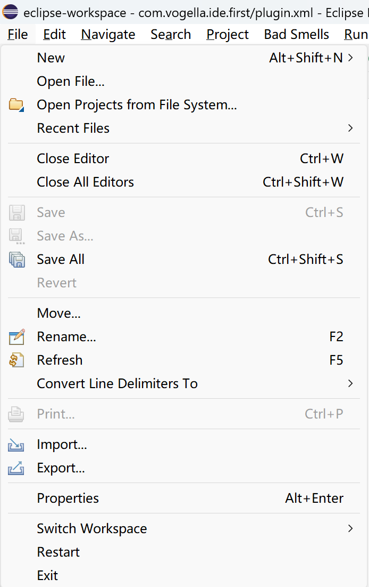
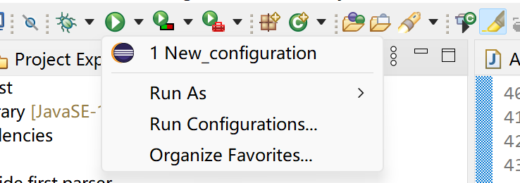
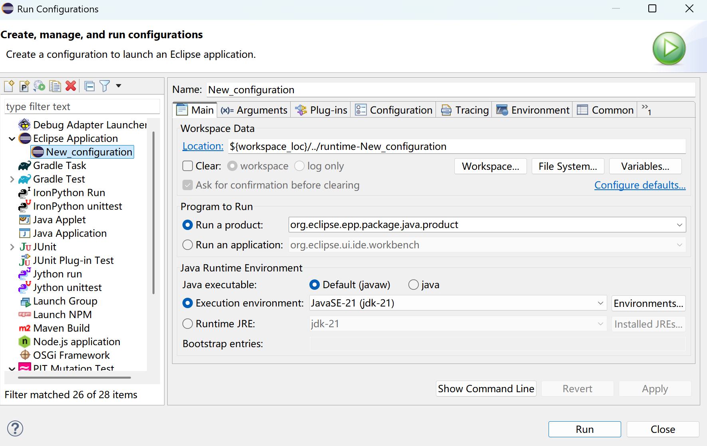
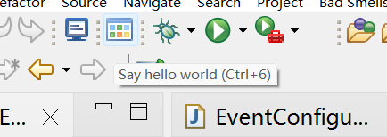
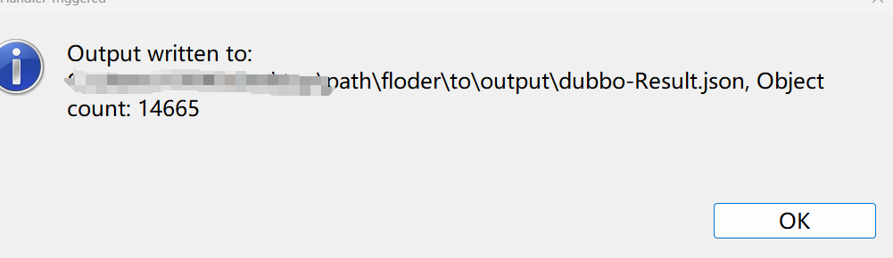

# JUnit Test Variable Analyzer (JDT-based)

This tool analyzes Java test classes that import JUnit and extracts information about all variables declared in those test methods. It uses Eclipse JDT to parse source code and generates structured JSON output for downstream analysis.

---

## What This Tool Does

- Recursively scans all Java files in the Eclipse workspace.
- Identifies test classes that import JUnit (e.g., `org.junit.Test`).
- Visits each test method and records all declared variables.
- Captures each variable’s name, declared type, instantiation method, and source code context.

---

## Output Format

Each variable is represented as a JSON object with the following fields:

| Field              | Description                                                                 |
|--------------------|-----------------------------------------------------------------------------|
| `filePath`         | Full path to the Java test file where the variable is declared             |
| `methodName`       | The name of the test method in which the variable is declared              |
| `methodAnnotations`| Annotations present on the method (e.g., `@Test`, `@Before`)               |
| `variableName`     | The name of the variable declared inside the method                        |
| `dependency`       | Fully-qualified class name of the variable's resolved type                 |
| `creationType`     | The instantiation pattern or method used (e.g., `Mockito.mock`, `new X`)   |
| `rawStatement`     | The full source line of the variable declaration (flattened to one line)   |

### Example Output

```json
{
  "filePath": "/dubbo-auth/src/test/java/org/apache/dubbo/auth/AccessKeyAuthenticatorTest.java",
  "methodName": "testSignForRequest",
  "methodAnnotations": "Test",
  "variableName": "url",
  "dependency": "org.apache.dubbo.common.URL",
  "creationType": "URL.addParameter",
  "rawStatement": "url=URL.valueOf(\"dubbo://10.10.10.10:2181\").addParameter(Constants.ACCESS_KEY_ID_KEY,\"ak\").addParameter(CommonConstants.APPLICATION_KEY,\"test\").addParameter(Constants.SECRET_ACCESS_KEY_KEY,\"sk\")"
}
```


## How to Use

This tool is implemented as an Eclipse Plug-in Project based on Eclipse JDT. Follow the steps below to set up and run the parser.

### 1. Environment

Tested on:

- Eclipse IDE for Java Developers (2024-06 or later)

We recommend using the same or a newer version.  
Download: https://www.eclipse.org/downloads/packages/

### 2. Import the Project

- In Eclipse, go to `File > Open Projects from File System...`
- Select the directory containing this project
- Eclipse will detect and import the `com.vogella.ide.first.parser` plug-in project

    
### 3. Set Output Path

- In the Project Explorer, open `com.vogella.ide.first.parser > src > com.vogella.ide.first.parser > TestObjectHandler.java`
- Locate the following line:

```java
    String outPutPath =  		
    	"path\\floder\\to\\output\\"
        + projects[0].getName() + "-Result.json";
```

- Replace it with the absolute path of the folder where you want the JSON output file to be saved

### 4. Launch the Plugin

- Go to `Run > Run Configurations...`

- Select `Eclipse Application` from the left sidebar

- Click `New Launch Configuration` (the white page icon)
- Click **Run**

A new Eclipse window (runtime Eclipse) will launch

### 5. In the Runtime Eclipse

- Open or import the Java projects you want to analyze (must contain JUnit-based test code)
- Make sure the project compiles and resolves all dependencies (especially if it's a Maven/Gradle project)

### 6. Run the Parser

- In the top menu of the runtime Eclipse, 

- The parser will analyze the test classes of your open projects
- When it finishes, a pop-up will appear with a message like:  
  `Output results to: C:\your\path\result.json`  
  `Object count: 248`

### 7. Check Output

- Navigate to the folder you configured in `TestObjectHandler.java`
- You will find a `.json` file containing the extracted variable information


